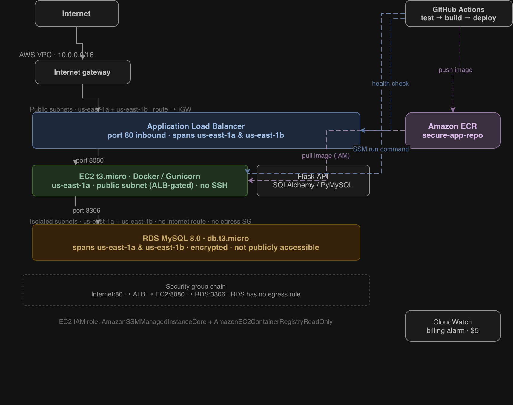

# Secure Multi-Tier Cloud Application

A production-grade, three-tier web application deployed on AWS using Infrastructure as Code and a fully automated CI/CD pipeline. No manual deployment steps.

---

## Architecture

The system implements a three-tier architecture within a custom AWS VPC, enforcing network-level isolation between layers via security groups. The EC2 instance is placed in a public subnet but is fully inaccessible from the internet — the security group only allows inbound traffic on port 8080 from the ALB. RDS lives in completely isolated subnets with no internet access whatsoever.



| Layer | Component | Placement |
|---|---|---|
| Presentation | Application Load Balancer (ALB) | Public Subnets (us-east-1a, us-east-1b) |
| Application | Dockerized Python/Flask API on EC2 t3.micro | Public Subnet (ALB-gated) |
| Data | Managed MySQL 8.0 on RDS db.t3.micro | Isolated Subnets (no internet) |
| Registry | Amazon ECR | N/A (managed service) |
| Automation | GitHub Actions + AWS SSM | N/A (zero SSH) |

---

## Tech Stack

| Technology | Role |
|---|---|
| Python 3.12 / Flask | Backend REST API |
| SQLAlchemy / PyMySQL | ORM and database connectivity |
| Docker | Multi-stage containerization |
| Gunicorn | WSGI production server |
| Terraform | Infrastructure as Code |
| GitHub Actions | CI/CD pipeline automation |
| AWS EC2, RDS, ALB, ECR, VPC | Cloud infrastructure |
| AWS Systems Manager (SSM) | Secure, SSH-less deployment |
| AWS CloudWatch | Billing cost protection alarm |

---

## API Endpoints

| Method | Endpoint | Description |
|---|---|---|
| `GET` | `/` | Welcome message |
| `GET` | `/health` | Health check — verifies DB connectivity |
| `POST` | `/users` | Create a new user |
| `GET` | `/users` | List all users |

### Example requests

```bash
# Health check
curl http://<alb-dns>/health

# Create a user
curl -X POST http://<alb-dns>/users \
  -H "Content-Type: application/json" \
  -d '{"username": "test", "email": "test@example.com"}'

# List all users
curl http://<alb-dns>/users
```

---

## Security Design

### Zero SSH Access
Port 22 is never opened. No key pair is attached to the EC2 instance. All deployments are executed via **AWS SSM Run Command**, eliminating the need for bastion hosts entirely.

### Network Isolation
Security groups enforce a strict chain-of-trust at the network level:

```
Internet → ALB (port 80)
ALB      → EC2 (port 8080 only, from ALB security group)
EC2      → RDS (port 3306 only, from EC2 security group)
RDS      → (no outbound rules — fully locked down)
```

### Least-Privilege IAM
The EC2 instance role carries only two policies: `AmazonSSMManagedInstanceCore` (for SSH-less deployments) and `AmazonEC2ContainerRegistryReadOnly` (for pulling images from ECR). No broad or administrative policies are attached.

### Secret Management
Database credentials are generated dynamically by Terraform at provisioning time using `random_password` and injected into the EC2 instance via `user_data` into a `.env` file. The container reads them as environment variables at runtime. No secrets are stored in source code or version control.

### Container Hardening
The Docker image uses a **multi-stage build** — dependencies are installed in a builder stage and only the compiled artifacts are copied to the final runtime image, minimizing the attack surface. The application runs as a **non-root user** (`appuser`), reducing the blast radius of any container-level compromise.

### Cost Protection
A CloudWatch billing alarm triggers if estimated AWS charges exceed **$5**, providing an early warning against runaway infrastructure costs.

---

## Local Development

**Prerequisites:** Docker, Docker Compose

```bash
# Clone the repository
git clone https://github.com/privjoesrepos/secure-cloud-app.git
cd secure-cloud-app

# Start the Flask API and a local MySQL database
make local
```

The API will be available at `http://localhost:8080`.

---

## Testing

The test suite uses an in-memory SQLite database — no live database or running server required.

```bash
pip install -r requirements.txt
python -m pytest tests/ -v
```

Five test cases are included:

| Test | What it verifies |
|---|---|
| `test_health_check` | `/health` returns 200 with DB connected |
| `test_create_user` | `POST /users` creates a user and returns 201 |
| `test_get_users` | `GET /users` returns the full user list |
| `test_duplicate_user` | Duplicate username returns 409 |
| `test_duplicate_email` | Duplicate email returns 409 (not 500) |

Lint is also enforced:

```bash
flake8 app/ tests/
```

---

## Infrastructure Deployment

**Prerequisites:** [Terraform](https://developer.hashicorp.com/terraform/install), AWS CLI configured with an IAM user that has sufficient permissions.

```bash
make tf-init     # Initialize Terraform providers
make tf-plan     # Preview what will be created
make tf-apply    # Provision all AWS infrastructure
```

After `tf-apply` completes, retrieve the outputs:

```bash
cd terraform
terraform output alb_dns_name                # Public URL for the API
terraform output db_endpoint                 # Internal RDS connection string
terraform output -raw db_password            # Dynamically generated DB password
```

Add the following as **GitHub Actions secrets** before triggering any deployment:

| Secret | Where to get it |
|---|---|
| `AWS_ACCESS_KEY_ID` | AWS IAM console |
| `AWS_SECRET_ACCESS_KEY` | AWS IAM console |
| `EC2_INSTANCE_ID` | AWS EC2 console or `terraform show` |
| `ALB_DNS_NAME` | `terraform output alb_dns_name` |

---

## CI/CD Pipeline

On every push to `main`, GitHub Actions executes three jobs automatically:

```
test → build-push → deploy
```

| Job | Steps |
|---|---|
| `test` | Lint with flake8, run pytest suite against SQLite |
| `build-push` | Build Docker image, tag with commit SHA, push to ECR |
| `deploy` | Issue SSM Run Command to EC2, poll for command completion, verify via ALB health check |

The deploy job does not rely on a blind sleep — it captures the SSM command ID, polls for the actual result, and only proceeds to the health check once the remote command is confirmed successful. If the SSM command fails, the pipeline fails immediately and prints the EC2 stderr output.

No manual steps are required after a `git push`.

---

## Teardown

To destroy all provisioned AWS resources and stop all charges:

```bash
make tf-destroy
```

---

## License

MIT